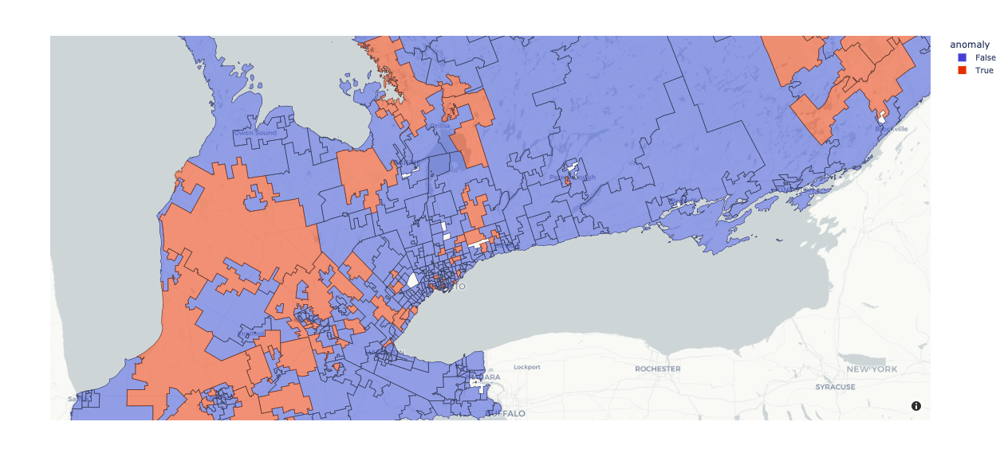
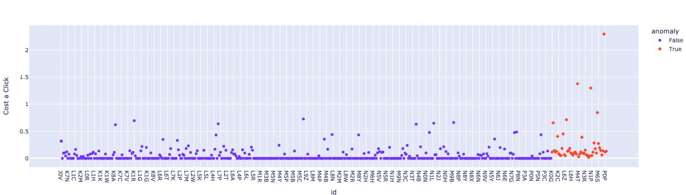

# Category Anomaly Detection in Clickstream Analytics
#### By Manuel Pardo and Leo Li, EQ Works

Uber Technologies wins multi-million dollar ad fraud case against Phunware according to [https://www.reedsmith.com/en/news/2021/01/reed-smith-wins-multimillion-dollar-advertising-fraud-suit-for-uber](URL "Uber v. Phunware"). [Business Insider reports digital ad fraud is estimated to cost %44 billion by 2022](URL "https://www.businessinsider.in/advertising/ad-tech/article/digital-ad-fraud-is-estimated-to-cost-brands-an-estimated-of-44-billion-to-fraudulent-activities-by-2022-and-reach-up-to-45-of-total-spent-mfilterit/articleshow/87753250.cms") and may be as high as 45% of total spend. These are just a few examples of the ubiquity and sophistication of the fraud that is endemic in the digital advertising industry.  

Ad fraud can fall into any of the following categories, hidden ads, click high-jacking, bots, and website spoofing that drive up impressions and clicks. The motivation is often about driving revenue for disreputable advertising platforms and inventory providers. Many media and inventory providers are incapable of detecting and quantifying this behaviour mostly because it isn’t in their favour.  Therefore it is very important to ask your DSP/DMP how they handle this kind of fraud. A good DSP/DMP platform will have automation put in place to protect their customer’s campaigns from fraud. 

DSPs (Demand Side Platforms) provide the environment where marketers can build campaigns and access digital ad space from a wide variety of ad exchanges and supply-side platforms. The DSP will place bids in real-time across all these different SSPs, allowing agencies and brands to have instantly updated information on the impressions available for their ad display. When website or app beacons are used, DSPs can report back on click throughs as well. This kind of automation and reporting allows brands and agencies to gain an understanding of the efficacy of their campaigns and creatives and allows media content providers and agencies to bill their customers based on impressions, clicks, and conversions. 

What started as curiosity inspired by the now famous AWS Zombie clause turned out to be an interesting anomaly detector that can satisfy many several use cases. After some initial laughter amongst ourselves, the idea to develop an NLP algorithm that can detect and extract text that seems out of place in a larger body of text. We used the machine learning libraries from Scikit-learn. Once we were successful in developing the programs that extracted the text that did not belong, we set our sights on other use cases for our anomaly detector. 
 
We set out to build a categorical anomaly and time series anomaly detector to assist in the detection of fraud in clickstream analytics. For the purposes of this discourse, we will focus on the categorical anomaly detector and leave the time series detector for another paper. In our sample code we used python and Jupyter Notebooks as the IDE because they are the default toolset used in the geospatial, machine learning, and data analytics ecosystem of which we’re part of and because, they are a visually easy way to walk through python code which is itself easier to read than other development languages.

The first thing we do is isolate and classify what is fraud. As mentioned above, fraud is any attempt to game the system by artificially injecting events like impressions or clicks into the clickstream data. How do we know when an event is an actual person viewing the media, clicking on it and actioning on it which we refer to as conversion or converting. Since conversion requires human interaction like filling in a form, making a purchase or subscribing to a service and we know bots cannot perform these actions cause 1. They can’t walk into or past a point of interest and 2. They can’t fill in forms that require specific PII like an email, phone number, social media account or mailing address. What we’re looking for is anomalies in the distribution of impressions, clicks, click-throughs, conversions

Let's get started with one of our sample dataset that we at EQ Works analyze regularly where we have the number of residents from a particular postal code that view, click on, and fill out a webform and spend associated with that particular segment. 

| geo_cohort_fsa   | geo_cohort_postalcode   |   geo_cohort_id |   impressions |   clicks |     spend |
|:-----------------|:------------------------|----------------:|--------------:|---------:|----------:|
| L1X              | L1X1B9                  |              79 |             2 |        0 |    0.029  |
| L1N              | L1N7Y5                  |              79 |             1 |        0 |    0.0145 |
| K1G              | K1G6R5                  |              79 |             2 |        0 |    0.029  |
| L1S              | L1S1H4                  |              79 |             2 |        0 |    0.029  |
| N0H              | N0H2K0                  |              79 |           771 |        2 |   11.1795 |
| N4S              | N4S7W3                  |              79 |            31 |        0 |    0.4495 |
| K7P              | K7P0H7                  |              79 |            43 |        0 |    0.6235 |
| L4C              | L4C8B6                  |              79 |             1 |        0 |    0.0145 |
| N6K              | N6K2X1                  |              79 |             2 |        0 |    0.029  |
| L1T              | L1T4B1                  |              79 |             1 |        0 |    0.0145 |
| L0K              | L0K1W0                  |              79 |           257 |        0 |    3.7265 |
| L6M              | L6M2G4                  |              79 |            10 |        0 |    0.145  |
| M1B              | M1B4L9                  |              79 |             1 |        0 |    0.0145 |
| L6Y              | L6Y4Z7                  |              79 |            17 |        1 |    0.2465 |
| L1V              | L1V2V3                  |              79 |             7 |        0 |    0.1015 |
| N0K              | N0K1N0                  |              79 |          5963 |       17 |   86.4635 |
| L5N              | L5N2N1                  |              79 |             9 |        0 |    0.1305 |
| L6T              | L6T3W8                  |              79 |             8 |        0 |    0.116  |
| L4H              | L4H0G5                  |              79 |             1 |        0 |    0.0145 |
| L4L              | L4L9G9                  |              79 |             9 |        0 |    0.1305 |
| M6N              | M6N3R9                  |              79 |             5 |        0 |    0.0725 |
| L3R              | L3R4H3                  |              79 |             2 |        0 |    0.029  |

After cleaning the data to remove any extraneous information not needed for this analysis we can see the table with the list of FSA codes, impressions, clicks, and spend. If you notice that there are wide variances in the calculation of impressions, clicks, and spend which we intend to analyze and check for fraud. 

|     | id   |   impressions |   clicks |     spend |
|----:|:-----|--------------:|---------:|----------:|
|   0 | J0V  |           651 |        2 |    9.4395 |
|   1 | J0X  |             5 |        0 |    0.0725 |
|   2 | J0Z  |            11 |        0 |    0.1595 |
|   3 | J8Y  |             1 |        0 |    0.0145 |
|   4 | J9A  |             1 |        0 |    0.0145 |
|   5 | K0A  |         54018 |       95 |  783.261  |
|   6 | K0B  |          2481 |        7 |   35.9745 |
|   7 | K0C  |         20000 |       25 |  290      |
|   8 | K0E  |         24247 |       27 |  351.582  |
|   9 | K0G  |         19634 |       29 |  284.693  |
|  10 | K0K  |         30567 |       38 |  443.222  |
|  11 | K0L  |         49887 |       71 |  723.361  |
|  12 | K0M  |         29291 |       43 |  424.719  |
|  13 | K1B  |           124 |        0 |    1.798  |
|  14 | K1C  |           259 |        0 |    3.7555 |
|  15 | K1E  |           253 |        0 |    3.6685 |
|  16 | K1K  |            33 |        0 |    0.4785 |
|  17 | K1L  |            18 |        0 |    0.261  |

Next We'll take the FSA's from the dataframe represented by the table above, parse and join it to a database that contains the geoJson polygons for each of them. You can see the sample below. 
   geometry                                           name
0  MULTIPOLYGON (((-74.38689 45.58202, -74.38291 ...  J0V
0  MULTIPOLYGON (((-75.54520 45.43477, -75.55599 ...  K1B
1  MULTIPOLYGON (((-77.93027 45.37394, -78.17846 ...  K0J
2  MULTIPOLYGON (((-78.91076 44.21080, -78.91731 ...  K0M
3  MULTIPOLYGON (((-77.52412 44.19382, -77.46114 ...  K8N

With data preparation complete we're now ready to pass it through our categorical anomaly detector. Our anomaly detector class has the option for four different algorithms depending on your requirements: 

- [https://www.dbs.ifi.lmu.de/Publikationen/Papers/LOF.pdf](URL "Local Outlier Factor - LOF")
- [https://scikit-learn.org/stable/auto_examples/svm/plot_oneclass.html](URL "OneClassSVM")  
- [https://en.wikipedia.org/wiki/Isolation_forest](URL "IsolationForest")
- [https://link.springer.com/article/10.1007/s10994-015-5521-0](URL "LODA")

For the first three, we can use an individual column as the label - in this case Win Rate. However LODA requires at least 2, so we've coded it to run on the numeric features of the dataset. The other datasets can also accept 2 or more for the metrics column. 

We feed the data into our anomaly detector setting the algorithm to LOF tunned for 3 postal codes and an outlier affinity of 0.1

Our model returns blue for expected activity and the oranges depicts regions where fraud is taking place. 
In the following scatter plot we can see that most of the fraud activity is coming from a select few postal codes. 

By identifying the outlying datapoints we can do further analysis and determine the level of fraud is affecting your campaign. We can now take steps to separate this information from our success metrics in order to protect our customers from being billed incorrectly and further investigate the source and report them as well as add them to block lists. 

